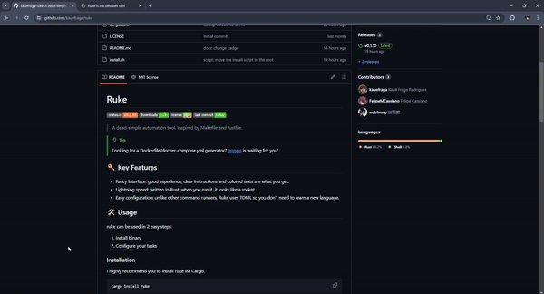

# `ruke`

[](https://crates.io/crates/ruke)
[](https://crates.io/crates/ruke)
[](https://github.com/kauefraga/ruke/blob/main/LICENSE)
[](https://github.com/kauefraga/ruke)

> A dead-simple automation tool. Inspired by Makefile and Justfile.

> [!TIP]
> Looking for a Dockerfile/docker-compose.yml generator? [gorvus](https://github.com/FelipeMCassiano/gorvus) is waiting for you!

<div align='center'>
    
</div>

<br />

Ruke is a **command runner** designed to be easy to configure and even easier to use. Ruke leverages Rust and TOML to provide such smoothness.

## 🔑 Key Features

- Fancy interface: good experience, clear instructions and colored texts are what you get.
- Lightning speed: written in Rust, when you run it, it looks like a rocket.
- Easy configuration: unlike other command runners, Ruke uses TOML so you don't need to learn a new language.

## 🛠 Usage

ruke can be used in 2 easy steps:

1. Install binary
2. Configure your tasks

### Installation

I highly recommend you to install ruke via Cargo.

```sh
cargo install ruke
```

If you don't have a Rust setup, you can install via the install script of your platform:

<details>
<summary>Linux / WSL and MacOS (Darwin)</summary>

> ```sh
> curl -sSfL https://raw.githubusercontent.com/kauefraga/ruke/main/install.sh | sh
> ```

</details>

<details>
<summary>Windows</summary>

> ```sh
> Invoke-WebRequest https://raw.githubusercontent.com/kauefraga/ruke/main/install.ps1 | iex
> ```

</details>

### Getting Started

First things first, you need to define your tasks in a `Ruke.toml` file.

Hopefully, Ruke can help you, just run

```sh
ruke init
```

With your `Ruke.toml` ready, now you need to run a specific task.

The syntax for running a task is `ruke [target]` where target is the task you wanna execute. Try this:

```sh
ruke
```

**Obs**.: the target task "main" is the default, therefore if you run `ruke`, it's the same as running `ruke main`.

### Mastering the CLI

###### Available commands

- `ruke init` - Create a `Ruke.toml` file with a task within
- `ruke list` - List existing tasks
- `ruke new` - Create a new task (interactive mode)
- `ruke add` - Add a command to an existing task (interactive mode)
- `ruke remove` - Remove an existing task (interactive mode)
- `ruke [target]` - Run a specific task

###### Aliases

- `ruke init`, `ruke i`
- `ruke list`, `ruke ls`
- `ruke new`, `ruke n`
- `ruke add`, `ruke a`
- `ruke remove`, `ruke rm`

###### Arguments and flags

| Command         | Flags                                                            |
|-----------------|------------------------------------------------------------------|
| `ruke init`     | doesn't have flags                                               |
| `ruke list`     | `-m --minimal`, `-f --file <FILE>`                               |
| `ruke new`      | `-n --name <NAME>`, `-f --file <FILE>`                           |
| `ruke add`      | `-n --name <NAME>`, `-c --command <COMMAND>`, `-f --file <FILE>` |
| `ruke remove`   | `-n --name <NAME>`, `-f --file <FILE>`                           |
| `ruke [target]` | `-q --quiet`, `-f --file <FILE>`                                 |

If you run `ruke --help` you'll see nice guide, and if you want help for a specific command, try `ruke help [command]`.

###### Examples

Output less information (just tasks name) than `ruke list`.

```sh
ruke list --minimal
```

Create a new task named "dev:f".

```sh
ruke new -n "dev:f"
```

Add commands in the task "dev:f".

```sh
ruke add -n "dev:f" -c "cd apps/frontend"
ruke add -n "dev:f" -c "bun dev"
# ruke dev:f
```

Remove the task "dev:f" from the Ruke.toml at an unexpected directory.

```sh
ruke remove -n "dev:f" -f path/to/Ruke.toml
```

Run the task "def:f" and show you the outputs.

```sh
ruke dev:f
```

Or `ruke dev:f -q` if you don't want to see outputs (`-q --quiet`).

### Mastering the Ruke file

I suggest you to use one of these two names: `Ruke.toml` or `Rukefile`, however, as long as you write a valid TOML, you can name the file whatever you want and pass it with the `-f --file <FILE>` flag.

Look at [the full spec of TOML v1.0.0](https://toml.io/en/v1.0.0).

```toml
[tasks.main]                       # defines a task with an unique name
commands = ["go run cmd/main.go"]  # defines a command array to be executed sequentially

[tasks."dev:f"]
commands = ["cd apps/frontend", "bun dev"]

[tasks."start:b"]
commands = ["cd apps/backend", "bun run build", "bun start"]

[tasks.build]
commands = ["go build -o gorvus cmd/main.go", "./gorvus"]
```

## 💖 Contributing

Feel free to contribute, create an issue to report a bug, suggest an API change, an improvement or a feature.

### How to contribute

1. Fork this repository
2. Clone your fork on your machine
3. Make your changes, commit and push these
4. Open a pull request (write a descriptive message about what you changed)

### Contributors

Thanks goes to these amazing people:

[](https://github.com/notshwuy)
[](https://github.com/FelipeMCassiano)

## 📝 License

This project is licensed under the MIT License - See the [LICENSE](https://github.com/kauefraga/ruke/blob/main/LICENSE) for more information.

---

Made with ❤ and 🦀 by Kauê Fraga Rodrigues.
